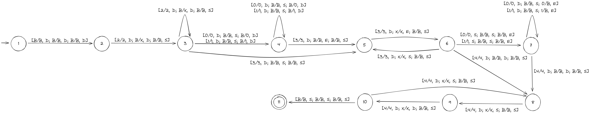
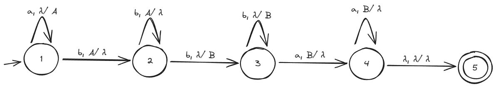

# 1

# 2
## A)

## B)

M = ({1, 2, 3, 4, 5, 6, 7, 8, 9}, {0, 1, 2, 3, 4}, {0, 1, 2, 3, 4, B}, δ, 1, {10}), onde:

    δ(1, B, B, B) = [2; B, D;  B, D; B, D]
    
    δ(2, 2, B, B) = [2; 2, D;  X, D; B, S]
    
    δ(2, 0, B, B) = [3; 0, D;  B, S; 0, D]
    
    δ(2, 1, B, B) = [3; 1, D;  B, S; 1, D]
    
    δ(2, 3, B, B) = [4; 3, D;  B, S; B, S]
    
    δ(3, 0, B, B) = [3; 0, D;  B, S; 0, D]
    
    δ(3, 1, B, B) = [3; A, D;  B, S; 1, D]
    
    δ(3, 3, B, B) = [4; 3, D;  B, E; B, S]
    
    δ(4, 3, X, B) = [5; 3, D;  X, E; B, S]
    
    δ(5, 3, X, B) = [5; 3, D;  X, S; B, S]
    
    δ(5, 0, B, B) = [6; 0, S;  B, S; B, E]
    
    δ(5, 1, B, B) = [6; 1, S;  B, S; B, E]
    
    δ(5, 4, B, B) = [7; 4, D;  B, S; B, S]
    
    δ(6, 0, B, 0) = [6; 0, D;  B, S; B, E]
    
    δ(6, 1, B, 1) = [6; 1, D;  B, S; B, E]
    
    δ(6, 4, B, B) = [7; 4, D;  B, D; B, S]
    
    δ(7, 4, X, B) = [8; 4, D;  X, S; B, S]
    
    δ(8, 4, X, B) = [8; 4, D;  X, D; B, S]
    
    δ(9, 4, X, B) = [7; 4, D;  X, S; B, S]
    
    δ(9, B, B, B) = [10; B, S;  B, S; B, S]

# 3

# 4
## A) 

G = ({Z, A, B}, {a, ba}, P, Z), onde:

P = {z -> AB

A -> aAb | ab

B -> bBa | ba}

## B)

## C)

M = ({1, 2, 3, 4}, {a, b}, {A, B}, δ, 1, {3}), onde:

δ(1, a, λ) = [1, A]

δ(1, b, A) = [2, λ]

δ(2, b, A) = [2, λ]

δ(2, b, λ) = [3, B]

δ(3, b, λ) = [3, B]

δ(3, a, B) = [4, λ]

δ(4, a, B) = [4, λ]

δ(4, λ, λ) = [5, λ]

# 5 

# 6 

# 7

